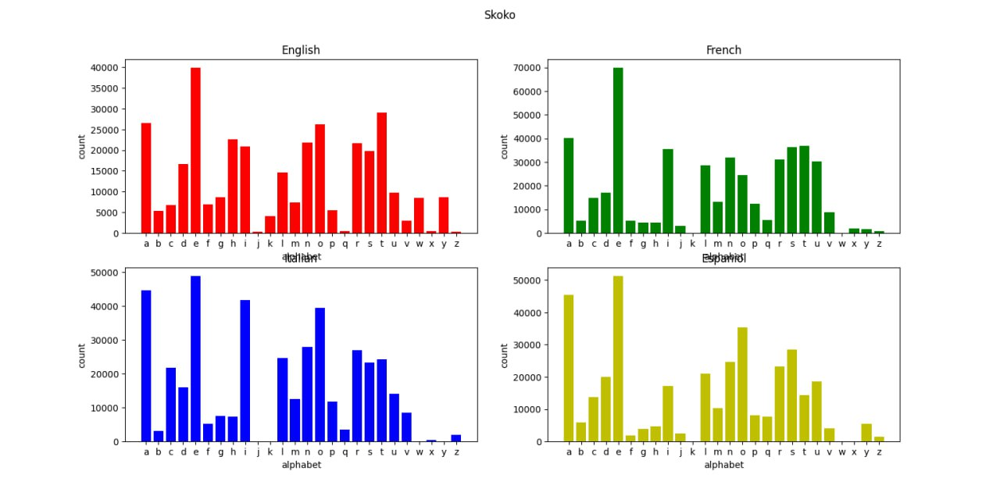

# Экзамен

## 1. Проверка на палиндром

**Описание:**  
Напишите функцию, которая определяет, является ли целое число палиндромом (читается одинаково слева направо и справа налево).

## 2. Количество латинских гласных

**Описание:**  
Напишите функцию, возвращающую количество латинских гласных букв (a, e, i, o, u, y) в строке. Регистр не учитывать.

## 3. Разворот строки по словам

**Описание:**  
Напишите функцию, которая принимает строку и возвращает новую строку, в которой слова (последовательности символов, разделённые пробелом) идут в обратном порядке.

**Пример:**

```python
reverse_words("Wikis are enabled by wiki software, otherwise known as wiki engines.")
# "engines. wiki as known otherwise software, wiki by enabled are Wikis"
```

## 4. Средняя температура (файл temps.txt)

**Описание:**  
В файле `temps.txt` в каждой строке записано одно число температура воздуха.  
Напишите функцию, которая вычисляет среднее значение температур.

## 5. Гравитационная постоянная по эксперименту

**Описание:**  
В файле `data.txt` даны столбцы:  
`trial`, `m1`, `m2`, `r`, `F`  
Для каждой строки вычислите гравитационную постоянную по формуле:  
`G = F * r**2 / (m1 * m2)`  
Найдите среднее значение G по всем экспериментам.

## 6. Плотность по эксперименту

**Описание:**  
В файле `experiment.txt` содержатся столбцы:  
`T (К)`, `V (м³)`, `m (кг)`.  
Добавьте новый столбец `rho` (плотность), где `rho = m / V`, и сохраните результат в файл `experiment_rho.txt`.


## 7. Matplotlib. Частота букв в текстах на разных языках

**Описание**
Есть 4 файла: `english.txt`, `french.txt`, `german.txt`, `italian.txt`
Для каждого файла нужно посчитать частоту появления латинских букв (регистр не учитывать). Затем отобразить результаты в виде четырёх отдельных графиков в одном окне Matplotlib, организовав их в сетку 2×2; по оси абсцисс каждого подграфика буквы от «a» до «z», по оси ординат соответствующая частота встречаемости, причём каждый график снабжён понятным заголовком с названием языка и подписями осей для наглядности.


[Пример кода с практики по matplotlib](https://colab.research.google.com/drive/1ho3KsBIOcM0qxi3v5aWfkNbjKbwbkwm_?usp=sharing)


Почта: galoyev.ilkin@gmail.com
Тема: Python_HSE. <Имя> <Фамилия>
